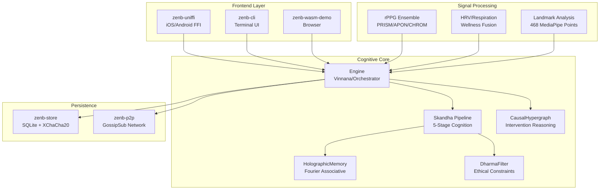
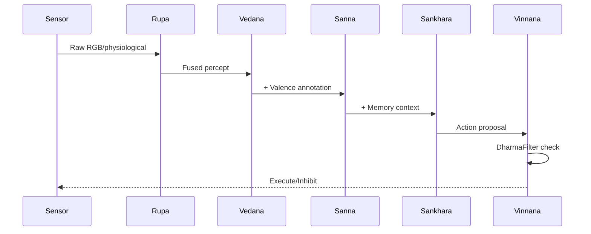
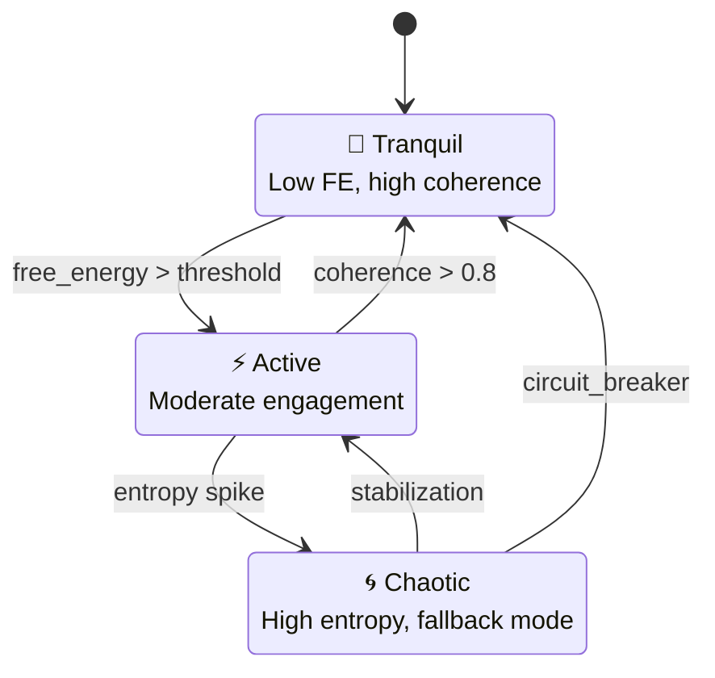
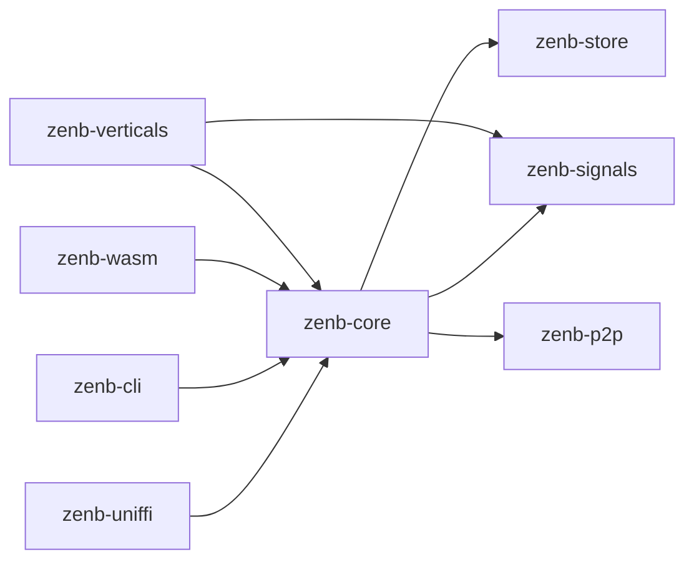

# AGOLOS Architecture Guide

> Comprehensive technical architecture for the Autonomous Goal-Oriented Learning Operating System

## System Overview



---

## Five Skandhas Pipeline

Buddhist-inspired cognitive processing stages:

| Skandha | Sanskrit | Function | Implementation |
|---------|----------|----------|----------------|
| **Rupa** | Form | Sensory input | `SheafPerception` - Geometric fusion |
| **Vedana** | Feeling | Affective valence | `BeliefEngine` - FEP emotional state |
| **Sanna** | Perception | Pattern recognition | `HolographicMemory` - Fourier recall |
| **Sankhara** | Formation | Action preparation | `IntentTracker` - Goal formation |
| **Vinnana** | Consciousness | Executive control | `Engine` - Decision orchestration |

### Data Flow



---

## Philosophical State Machine

Three-state cognitive regulation based on Free Energy Principle:



| State | Free Energy | Coherence | Behavior |
|-------|-------------|-----------|----------|
| **YÊN** | Low | High | Minimal intervention, energy conservation |
| **ĐỘNG** | Moderate | Moderate | Active learning, exploration |
| **HỖN LOẠN** | High | Low | Circuit breaker, safe defaults |

---

## Memory Architecture

### HolographicMemory

Fourier-domain associative memory with GPU acceleration:

```
┌─────────────────────────────────────────────────┐
│             HolographicMemory                   │
├─────────────────────────────────────────────────┤
│  entangle(pattern)                              │
│    1. FFT(pattern) → frequency domain           │
│    2. Superimpose onto hologram                 │
│    3. Normalize energy                          │
├─────────────────────────────────────────────────┤
│  recall(cue)                                    │
│    1. FFT(cue) → frequency domain               │
│    2. Multiply with hologram conjugate          │
│    3. IFFT → reconstructed pattern              │
│    4. Similarity scoring                        │
└─────────────────────────────────────────────────┘
```

### HDC (Hyperdimensional Computing)

Binary vector memory for NPU acceleration:

- 10,000-dim binary vectors
- XOR binding, majority bundling
- Hamming distance similarity

---

## Safety Architecture

### DharmaFilter

LTL (Linear Temporal Logic) constraint monitoring:

```rust
// Example ethical constraint
□(harm_detected → ¬action_executed)  // Always: if harm detected, don't execute

// Implementation as TraumaPattern
TraumaPattern {
    signature: [...],
    severity: HarmLevel::Critical,
    response: Response::Inhibit,
}
```

### Safety Swarm

Multi-agent consensus voting:

```
┌─────────────────────────────────────────┐
│           Safety Swarm (3-of-5)         │
├─────────────────────────────────────────┤
│  [Guard 1] ─┐                           │
│  [Guard 2] ─┼─→ Majority Vote → Decision│
│  [Guard 3] ─┤                           │
│  [Guard 4] ─┤                           │
│  [Guard 5] ─┘                           │
└─────────────────────────────────────────┘
```

---

## Crate Dependencies



---

## Key Invariants

1. **Free Energy Never Negative**: `assert!(free_energy >= 0.0)`
2. **Causality Preserved**: No cycles in CausalHypergraph
3. **Safety Always Checked**: Every action passes DharmaFilter
4. **Memory Bounded**: Hologram energy normalized after each entangle
5. **Encryption At Rest**: All persisted data uses XChaCha20-Poly1305

---

## Performance Characteristics

| Operation | Latency | Throughput |
|-----------|---------|------------|
| rPPG frame process | ~2ms | 500 fps |
| Skandha pipeline | ~5ms | 200 Hz |
| Holographic recall | ~1ms (CPU), ~0.1ms (GPU) | - |
| Safety filter check | <100μs | - |

---

*For API details, see [rustdoc](cargo doc --workspace --open)*
