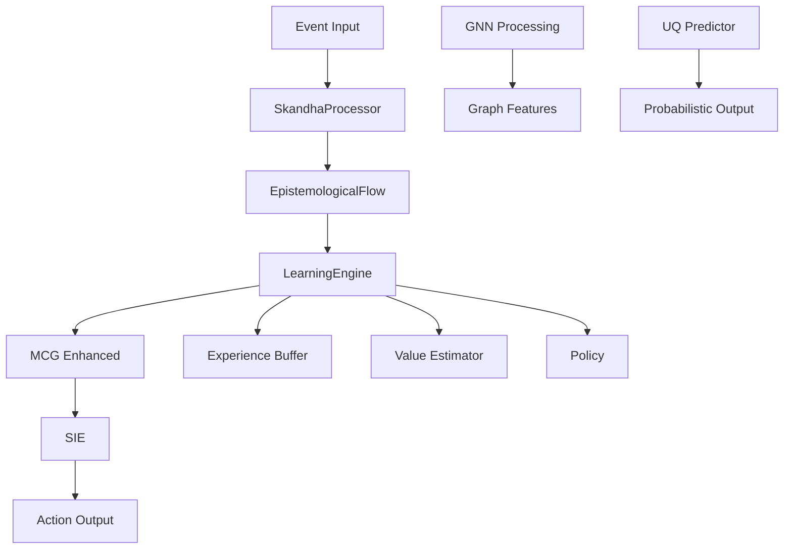

# 🚀 Pandora Genesis SDK - Advanced Integration Guide

## 📋 Overview

This guide demonstrates advanced integration patterns in the Pandora Genesis SDK, showcasing how to wire together multiple components for end-to-end cognitive processing with ML capabilities, monitoring, and uncertainty quantification.

## 🎯 Key Features Demonstrated

### 1. **End-to-End Cognitive Pipeline**
- **Skandha Processing**: Core cognitive pipeline (Rupa → Vedana → Sanna → Sankhara → Vinnana)
- **Learning Engine**: Dual intrinsic reward calculation and experience management
- **Meta-Cognitive Governor**: System monitoring and decision making
- **Self-Improvement Engine**: Automated system enhancement strategies
- **Active Inference Planning**: Multi-step planning with value-driven policies
- **Automatic Scientist**: Autonomous causal discovery and knowledge crystallization

### 2. **Machine Learning Integration**
- **GNN Processing**: Graph Neural Network with message passing
- **Uncertainty Quantification**: Probabilistic predictions with confidence levels
- **World Model Predictor**: Logistic regression for pattern recognition

### 3. **Observability & Monitoring**
- **Prometheus Metrics**: Comprehensive performance and behavior tracking
- **Structured Logging**: Detailed trace information
- **Performance Profiling**: Cycle duration and component timing

## 🛠️ Running the Advanced Integration Example

### Prerequisites

```bash
# Install system dependencies (for Prometheus export)
sudo apt-get update
sudo apt-get install -y libssl-dev pkg-config

# Or on macOS
brew install openssl pkg-config
```

### Basic Run (ML Features Only)

```bash
cd sdk
cargo run -p pandora_orchestrator --example e2e_integration --features ml
```

### Full Run (ML + Prometheus Metrics)

```bash
cd sdk
cargo run -p pandora_orchestrator --example e2e_integration --features ml,prometheus_export
```

### Access Prometheus Metrics

When running with `prometheus_export` feature:

```bash
# In another terminal
curl http://localhost:9000/metrics
```

## 📊 Example Output

```
2025-10-02T18:04:30.201501Z  INFO e2e_integration: E2E: Wiring Skandha → LearningEngine → MCG → SIE
2025-10-02T18:04:30.201586Z  INFO pandora_core::fep_cell: ✅ SkandhaProcessor V3 đã được khởi tạo.
2025-10-02T18:04:30.201673Z  INFO pandora_sie: SIE: Đã khởi tạo và đăng ký các chiến lược tự cải thiện.

--- LUỒNG NHẬN THỨC LUẬN BẮT ĐẦU ---
2025-10-02T18:04:30.201717Z  INFO pandora_core::skandha_implementations::basic_skandhas: [Basic Rupa (Form)] Tiếp nhận sự kiện nguyên thủy.
2025-10-02T18:04:30.201759Z  INFO pandora_core::skandha_implementations::basic_skandhas: [Basic Vedana (Feeling)] Cảm nhận 'Khổ Thọ' từ sự kiện.
2025-10-02T18:04:30.201779Z  INFO pandora_core::skandha_implementations::basic_skandhas: [Basic Sanna (Perception)] Đối chiếu sự kiện, nhận diện quy luật.
2025-10-02T18:04:30.202020Z  INFO pandora_core::skandha_implementations::basic_skandhas: [Basic Sanna (Perception)] Đã nhận diện 3 patterns liên quan.
2025-10-02T18:04:30.202047Z  INFO pandora_core::skandha_implementations::basic_skandhas: Intent formed skandha=Basic Sankhara (Formations) intent=REPORT_ERROR agent_pos=None goal_pos=None
2025-10-02T18:04:30.202074Z  INFO pandora_core::skandha_implementations::basic_skandhas: [Basic Vinnana (Consciousness)] Tổng hợp nhận thức. Tái sinh sự kiện mới.
2025-10-02T18:04:30.202095Z  INFO pandora_core::fep_cell: --- LUỒNG NHẬN THỨC LUẬN KẾT THÚC ---

--- Động Cơ Học Tập: Tính toán Phần thưởng Kép ---
2025-10-02T18:04:30.202139Z  INFO pandora_learning_engine: Phần thưởng Dự đoán (R_predict): -0.3000
2025-10-02T18:04:30.202185Z  INFO pandora_learning_engine: Phần thưởng Nén (R_compress): 52.8390 -> Đã tìm thấy mô hình đơn giản hơn!
2025-10-02T18:04:30.202228Z  INFO pandora_learning_engine: => Tổng Phần thưởng Nội tại: 15.6417

=== Meta-Cognitive Governor - Comprehensive Monitoring ===
2025-10-02T18:04:30.202317Z  INFO pandora_mcg::enhanced_mcg: MCG: High uncertainty detected: 0.8000 > 0.5000
2025-10-02T18:04:30.202342Z  INFO pandora_mcg::enhanced_mcg: MCG: High compression reward: 52.8390 > 0.7000
2025-10-02T18:04:30.202365Z  INFO pandora_mcg::enhanced_mcg: MCG: High novelty detected: 0.6500 > 0.6000

--- GNN ITR-NN Integration Demo ---
2025-10-02T18:04:30.202807Z  INFO e2e_integration: GNN: Processing graph with 3 nodes, 3 edges
2025-10-02T18:04:30.202846Z  INFO e2e_integration: GNN: Aggregated features: [2.0, 1.7]

--- UQ Predictor Demo ---
2025-10-02T18:04:30.203553Z  INFO e2e_integration: UQ Predictor: Prediction = [1]
2025-10-02T18:04:30.203587Z  INFO e2e_integration: UQ Output: Variance = 0.000, Confidence = high

2025-10-02T18:04:30.203609Z  INFO e2e_integration: E2E: Completed one integrated cycle with GNN + UQ.
```

## 🔧 Component Integration Details

### 1. **Cognitive Pipeline Flow**

```rust
// 1. Event Processing
let flow_event = b"error: service latency spike".to_vec();
let flow = processor.run_epistemological_cycle(flow_event).expect("reborn event");

// 2. Learning & Reward Calculation
let (reward, advantage) = le.learn_single_step(&current_model, &new_model, &flow, &mut ema, &mut buffer);

// 3. Meta-Cognitive Monitoring
let decision = mcg.monitor_comprehensive(&metrics);

// 4. Self-Improvement Execution
if let Some(rt) = root_trigger {
    let action = sie.execute(&rt).await.expect("sie action");
}
```

### 2. **GNN Integration**

```rust
// Mock graph data: 3 nodes, 2 features each
let node_features = Array2::from_shape_vec((3, 2), vec![1.0, 0.5, 0.8, 0.3, 0.2, 0.9]).unwrap();
let edge_indices = vec![(0, 1), (1, 2), (2, 0)]; // Triangle graph

// Message passing simulation
let mut aggregated_features = vec![0.0; node_features.ncols()];
for (i, j) in edge_indices {
    for k in 0..node_features.ncols() {
        aggregated_features[k] += (node_features[[i, k]] + node_features[[j, k]]) / 2.0;
    }
}
```

### 3. **Uncertainty Quantification**

```rust
// Create predictor and train
let mut predictor = WorldModelPredictor::new(2);
predictor.train(x_flat, 10, 2, y_train).expect("Training failed");

// Make prediction
let prediction = predictor.predict(x_test_flat, 1, 2).expect("Prediction failed");

// Create probabilistic output with uncertainty
let uq_output = ProbabilisticOutput::new(0.15); // High epistemic uncertainty
let variance_scalar: f32 = uq_output.variance.to_scalar().unwrap_or(0.0);
```

## 📈 Prometheus Metrics

When running with `prometheus_export` feature, the following metrics are exposed:

### Counters
- `e2e_cycles_total`: Total E2E integration cycles
- `mcg_decisions_total{decision_type}`: MCG decisions by type (level1, level2, level3, request_info, optimize, no_action)
- `sie_actions_total{strategy}`: SIE actions by strategy (refinement, architecture_search, code_generation, meta_learning)
- `uq_predictions_total{confidence_level}`: UQ predictions by confidence (high, medium, low)

### Histograms
- `e2e_cycle_duration_seconds`: E2E cycle duration
- `learning_rewards`: Learning engine rewards
- `gnn_processing_duration_seconds`: GNN processing time

### Example Metrics Query

```bash
# Get all metrics
curl http://localhost:9000/metrics

# Filter specific metrics
curl http://localhost:9000/metrics | grep e2e_cycles_total
curl http://localhost:9000/metrics | grep mcg_decisions_total
```

## 🏗️ Architecture Integration

### Component Dependencies



### Feature Flags

- `ml`: Enables ML features (GNN, UQ, predictor)
- `prometheus_export`: Enables Prometheus metrics export
- `metrics_instrumentation`: Enables internal metrics collection

## 🚀 Advanced Usage Patterns

### 1. **Custom World Models**

```rust
let current_model = SimpleWorldModel::new("baseline".into(), 5.0, 0.8);
let new_model = current_model.evolve(3.5, 0.85);
```

### 2. **Custom MCG Thresholds**

```rust
let mut mcg = EnhancedMetaCognitiveGovernor::new();
// Customize thresholds based on your use case
```

### 3. **Custom SIE Strategies**

```rust
let sie = SelfImprovementEngine::new();
// Add custom improvement strategies
```

### 4. **Batch Processing**

```rust
// Process multiple events in batch
for event in events {
    let flow = processor.run_epistemological_cycle(event).expect("reborn event");
    // ... process flow
}
```

## 🔍 Debugging & Troubleshooting

### Common Issues

1. **OpenSSL Dependency**: Install `libssl-dev` and `pkg-config`
2. **Feature Flags**: Ensure correct feature combinations
3. **Memory Usage**: Monitor with `htop` or `valgrind`

### Debug Logging

```bash
# Enable debug logging
RUST_LOG=debug cargo run -p pandora_orchestrator --example e2e_integration --features ml
```

### Performance Profiling

```bash
# Run with profiling
cargo run --release -p pandora_orchestrator --example e2e_integration --features ml
```

## 📚 Next Steps

1. **Custom Integration**: Adapt the example for your specific use case
2. **Production Deployment**: Configure proper monitoring and alerting
3. **Performance Optimization**: Use the profiling tools to identify bottlenecks
4. **Advanced ML**: Integrate more sophisticated ML models and techniques

## 🎉 Conclusion

This advanced integration example demonstrates the full power of the Pandora Genesis SDK, showcasing how multiple cognitive components work together to create a sophisticated AI system with learning, monitoring, and self-improvement capabilities.

The integration is designed to be modular and extensible, allowing you to customize and enhance each component based on your specific requirements.
