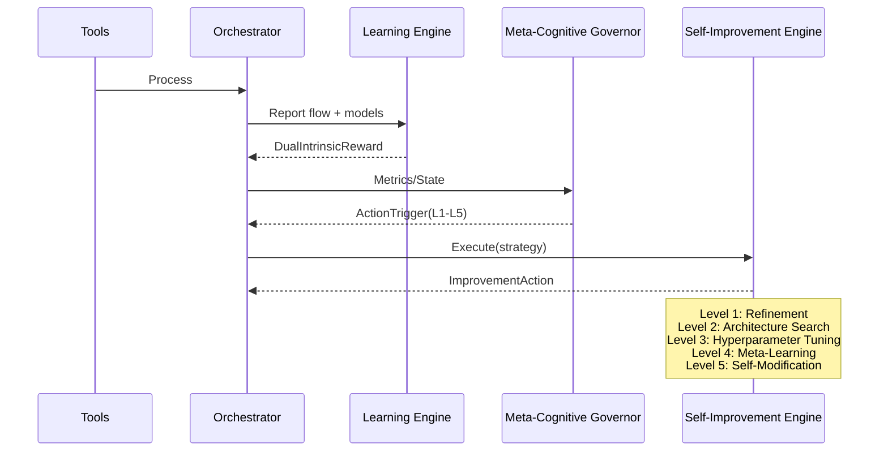
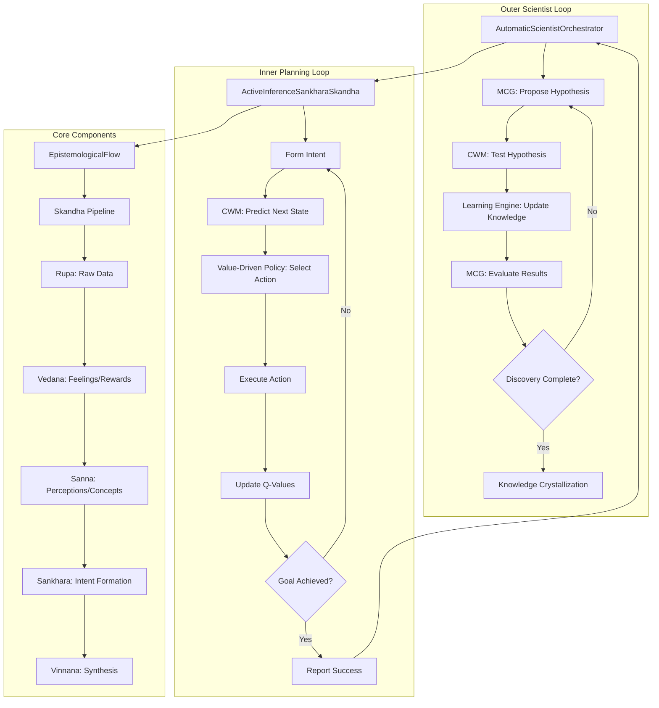

# Pandora Genesis SDK — Architecture Overview

## High-level Components

- `pandora_core`: Ontology and traits (FEPCell, Skandhas, WorldModel)
- `pandora_tools`: Skills and agents
- `pandora_orchestrator`: Skill orchestration, circuit breaker
- `pandora_cwm`: Causal World Model (VSA/NN/TDA)
- `pandora_learning_engine`: Rewards and learning loop
- `pandora_mcg`: Meta-Cognitive Governor
- `pandora_sie`: Self-Improvement Engine (5 levels)
- `pandora_uniffi`: Python bindings and cross-language support

## Cognitive Pipeline (Skandhas)


## Self-Improvement Loop (5 Levels)



## Complete Cognitive Architecture



## Active Inference Planning Engine

The system now includes a complete Active Inference Planning Engine with:

1. **CWM Decoder**: Translates predicted state embeddings back into meaningful changes
2. **Value-Driven Policy**: Uses Q-learning with UCB1 exploration
3. **Multi-step Planning**: Handles complex scenarios with non-obvious solutions
4. **Non-attachment Learning**: Adapts to environment changes

### Key Features

- **Neural Q-Value Estimator**: Predicts future rewards for all actions
- **UCB1 Exploration**: Balances exploitation and exploration intelligently
- **Sequential Discovery**: Can discover complex causal relationships (A→B→C)
- **Environment Adaptation**: Learns to abandon old strategies when environment changes

## Python Bindings

The SDK includes comprehensive Python bindings for easy integration:

```python
from pandora_sdk import hello, get_version, run_gridworld_simulation

# Basic usage
print(get_version())  # Pandora Genesis SDK v1.0.0
print(hello("World"))  # Hello from Pandora SDK, World!

# Run simulation
result = run_gridworld_simulation()
print(result)  # GridWorld simulation completed successfully!
```

### Features
- **Native Python Support**: Full API access from Python
- **Easy Installation**: Simple pip install
- **Cross-Platform**: Works on Linux, macOS, and Windows
- **Production Ready**: Optimized for real-world applications

## Observability

- Tracing spans on critical paths (SIE/MCG)
- Optional Prometheus exporter (example `monitoring`): `:9000/metrics`
- Performance profiling with flamegraph support
- Memory usage monitoring

## Build Profiles & Features

- `pandora_cwm/ml`: ML stack
- `pandora_mcg/metrics_instrumentation`, `pandora_sie/metrics_instrumentation`
- `pandora_orchestrator/prometheus_export` (example only)
- `pandora_uniffi`: Python bindings generation


